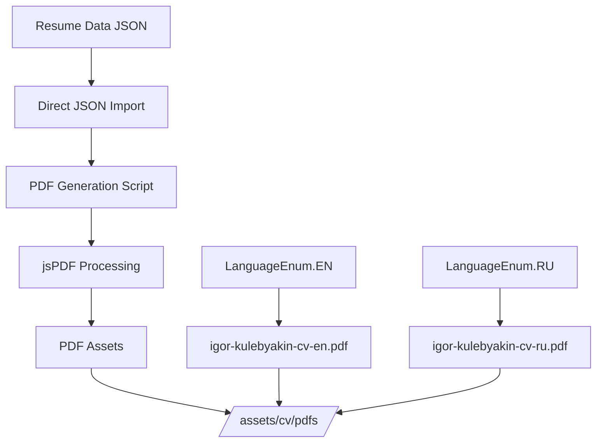
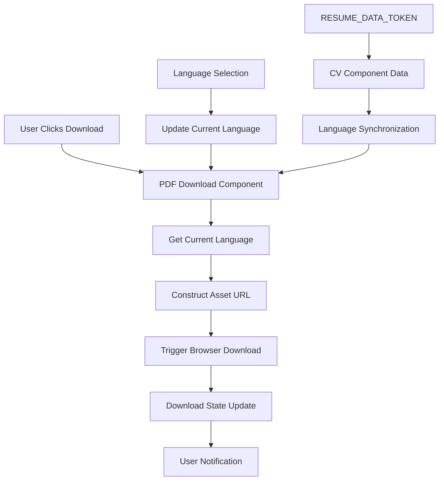
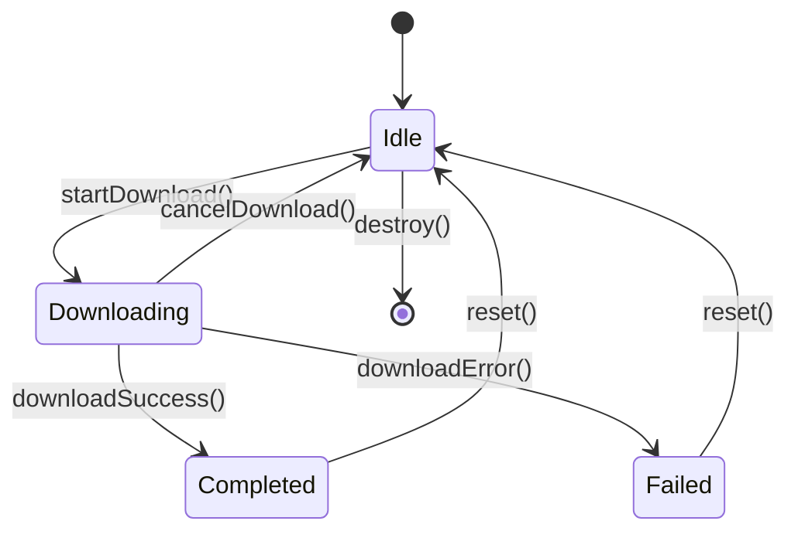

# Data Model: CV PDF Download

**Date**: 2026-03-23  
**Feature**: CV PDF Download (010-cv-pdf-download)  
**Status**: Final - Complete data structure definition

## Overview

The CV PDF Download feature leverages existing data structures from the CV component with minimal additions for PDF-specific functionality. All core data is provided by the existing `IResumeData` interface and `RESUME_DATA_TOKEN`.

## Core Data Entities

### 1. PDF Download Configuration

```typescript
interface IPDFDownloadConfig {
    /** Available languages for PDF generation */
    supportedLanguages: LanguageEnum[];
    /** Base path for PDF assets */
    assetBasePath: string;
    /** File naming pattern */
    fileNamingPattern: string;
    /** PDF quality settings */
    qualitySettings: IPDFQualitySettings;
}
```

### 2. PDF Quality Settings

```typescript
interface IPDFQualitySettings {
    /** DPI for print quality */
    dpi: number;
    /** Font embedding configuration */
    fontEmbedding: boolean;
    /** Vector graphics support */
    vectorGraphics: boolean;
    /** Compression level */
    compressionLevel: number;
    /** Compact layout optimization */
    compactLayout: boolean;
    /** Minimum font size for readability */
    minFontSize: number;
    /** Page optimization strategy */
    pageOptimization: 'compact' | 'comfortable' | 'balanced';
}
```

### 3. Download State

```typescript
interface IPDFDownloadState {
    /** Currently selected language */
    currentLanguage: LanguageEnum;
    /** Download in progress flag */
    isDownloading: boolean;
    /** Last download timestamp */
    lastDownload?: Date;
    /** Download error state */
    error?: IPDFDownloadError;
}
```

### 4. Download Error

```typescript
interface IPDFDownloadError {
    /** Error code for identification */
    code: PDFDownloadErrorCode;
    /** Human-readable error message */
    message: string;
    /** Timestamp of error occurrence */
    timestamp: Date;
    /** Additional error context */
    context?: Record<string, unknown>;
}
```

### 5. Download Event

```typescript
interface IPDFDownloadEvent {
    /** Type of download event */
    type: PDFDownloadEventType;
    /** Language for PDF download */
    language: LanguageEnum;
    /** Event timestamp */
    timestamp: Date;
    /** Optional event data */
    data?: unknown;
}
```

## Enums

### PDF Download Error Codes

```typescript
enum PDFDownloadErrorCode {
    /** Asset not found for requested language */
    ASSET_NOT_FOUND = 'ASSET_NOT_FOUND',
    /** Network error during download */
    NETWORK_ERROR = 'NETWORK_ERROR',
    /** File system access error */
    FILE_ACCESS_ERROR = 'FILE_ACCESS_ERROR',
    /** Unsupported language requested */
    UNSUPPORTED_LANGUAGE = 'UNSUPPORTED_LANGUAGE',
    /** Download interrupted by user */
    DOWNLOAD_INTERRUPTED = 'DOWNLOAD_INTERRUPTED',
    /** Unknown error occurred */
    UNKNOWN_ERROR = 'UNKNOWN_ERROR'
}
```

### PDF Download Event Types

```typescript
enum PDFDownloadEventType {
    /** Download initiated */
    DOWNLOAD_STARTED = 'DOWNLOAD_STARTED',
    /** Download completed successfully */
    DOWNLOAD_COMPLETED = 'DOWNLOAD_COMPLETED',
    /** Download failed */
    DOWNLOAD_FAILED = 'DOWNLOAD_FAILED',
    /** Download cancelled */
    DOWNLOAD_CANCELLED = 'DOWNLOAD_CANCELLED'
}
```

## Existing Data Structures (Leveraged)

### Resume Data (from existing CV component)

```typescript
// From: /src/app/components/cv/types.ts
interface IResumeData {
    meta: IMeta;
    personal: IPersonal;
    summary: IMultilingualTextBlock[];
    topSkills: string[];
    certifications: IMultilingualText[];
    portfolio: IPortfolio[];
    experience: IExperience[];
    education: IEducation[];
    skills: ISkills;
}

interface IMultilingualText {
    [LanguageEnum.EN]: string;
    [LanguageEnum.RU]: string;
}

interface IMultilingualTextBlock {
    [LanguageEnum.EN]: ITextBlock;
    [LanguageEnum.RU]: ITextBlock;
}
```

### Language Configuration (from existing system)

```typescript
// From: /types/translation.ts
enum LanguageEnum {
    EN = 'en',
    RU = 'ru'
}
```

## Data Flow Architecture

### Build-time Data Flow (Node.js Environment)



### Runtime Data Flow (Angular DI Environment)



### Architecture Separation

**Build-time (Outside Angular DI)**:

- PDF generation runs in Node.js environment
- Cannot access Angular's dependency injection system
- Uses direct JSON import (same source as RESUME_DATA_TOKEN)
- Outputs static PDF assets

**Runtime (Inside Angular DI)**:

- Components use Angular's dependency injection
- Leverages existing RESUME_DATA_TOKEN for consistency
- Serves pre-generated static assets
- Maintains Angular patterns and testability

## Validation Rules

### Input Validation

```typescript
interface IPDFDownloadValidationRules {
    /** Language must be supported */
    validateLanguage: (language: string) => language is LanguageEnum;
    /** Asset URL must be valid */
    validateAssetURL: (url: string) => boolean;
    /** Download state must be consistent */
    validateDownloadState: (state: IPDFDownloadState) => boolean;
}
```

### Business Rules

1. **Language Support**: Only languages with existing PDF assets can be downloaded
2. **File Naming**: PDF files must follow pattern `cv-{language}.pdf`
3. **Asset Location**: All PDFs must be stored in `/assets/cv/pdfs/`
4. **Quality Standards**: All PDFs must meet 300 DPI professional quality
5. **Size Limits**: Individual PDF files must not exceed 500KB
6. **Layout Optimization**: PDFs must balance compactness (minimal pages) with readability (comfortable font size and spacing)

## State Transitions

### Download State Machine



### State Transition Rules

```typescript
interface IStateTransitionRules {
    /** Can start download from idle state */
    canStartDownload: (state: IPDFDownloadState) => boolean;
    /** Can cancel active download */
    canCancelDownload: (state: IPDFDownloadState) => boolean;
    /** Can reset after completion/error */
    canReset: (state: IPDFDownloadState) => boolean;
}
```

## Performance Considerations

### Memory Management

- **State Objects**: Minimal state footprint (<1KB)
- **Error Handling**: Lightweight error objects
- **Event Emission**: Efficient event streaming

### Caching Strategy

- **Asset URLs**: Cached for session duration
- **Language State**: Persistent across component lifecycle
- **Error States**: Cached to prevent repeated failures

## Integration Points

### CV Component Integration

```typescript
interface ICVComponentIntegration {
    /** Language synchronization */
    languageSync: {
        source: 'CV_COMPONENT';
        target: 'PDF_DOWNLOAD_COMPONENT';
        event: 'LANGUAGE_CHANGED';
        data: LanguageEnum;
    };

    /** Data sharing (runtime only) */
    dataSharing: {
        source: 'RESUME_DATA_TOKEN';
        target: 'CV_COMPONENT';
        access: 'READ_ONLY';
        data: IResumeData;
    };

    /** Asset serving (build-time generated) */
    assetServing: {
        source: 'BUILD_SCRIPT';
        target: 'PDF_DOWNLOAD_COMPONENT';
        access: 'STATIC_ASSETS';
        data: 'PDF files';
    };
}
```

### Asset Management Integration

```typescript
interface IAssetManagementIntegration {
    /** Base asset path configuration */
    assetBasePath: string;
    /** File existence validation */
    assetExists: (filename: string) => boolean;
    /** URL construction utilities */
    buildAssetURL: (filename: string) => string;
}
```

## Testing Data Structures

### Test Fixtures

```typescript
interface IPDFDownloadTestFixtures {
    /** Mock resume data for testing */
    mockResumeData: IResumeData;
    /** Mock PDF download configuration */
    mockConfig: IPDFDownloadConfig;
    /** Sample download states */
    sampleStates: IPDFDownloadState[];
    /** Error scenarios */
    errorScenarios: IPDFDownloadError[];
}
```

## Future Extensibility

### Potential Enhancements

1. **Additional Languages**: Extensible language support
2. **PDF Templates**: Multiple template options
3. **Custom Branding**: Configurable PDF styling
4. **Analytics Integration**: Download tracking
5. **Batch Downloads**: Multiple language downloads

### Extension Points

```typescript
interface IPDFDownloadExtensions {
    /** Custom PDF generators */
    pdfGenerator: IPDFGenerator;
    /** Custom styling providers */
    stylingProvider: IStylingProvider;
    /** Analytics tracking */
    analyticsTracker: IAnalyticsTracker;
}
```

## Conclusion

The data model leverages existing robust infrastructure while adding minimal, focused structures for PDF download functionality. The design maintains type safety, performance optimization, and extensibility for future enhancements.
